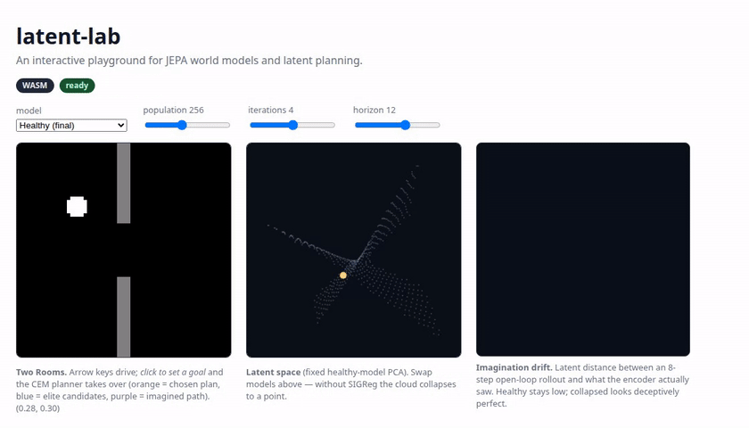
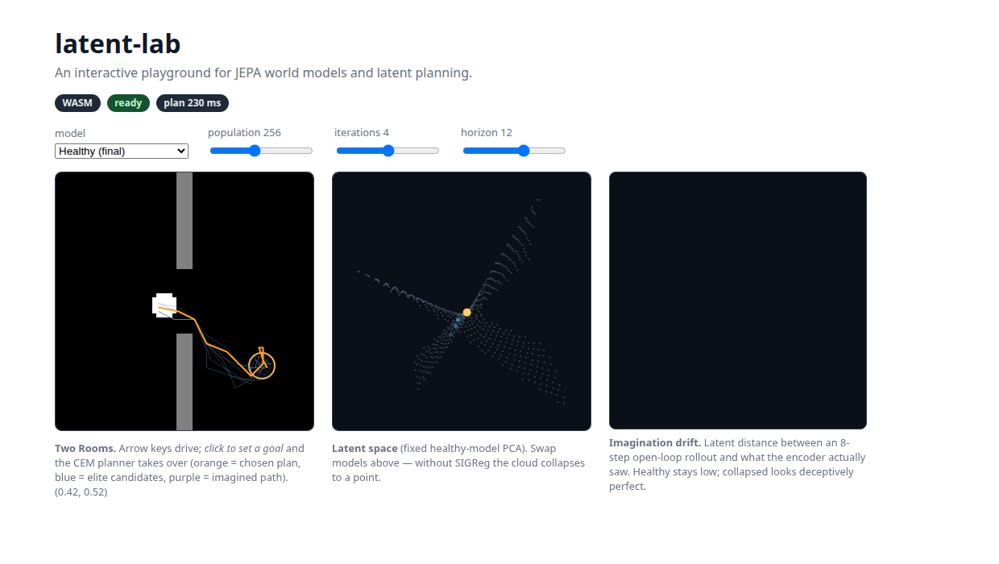
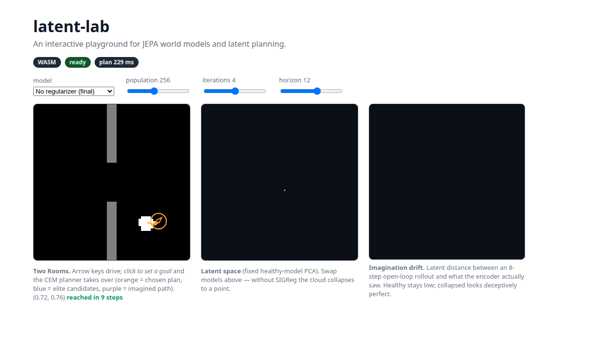

# latent-lab

> An interactive, browser-based playground for understanding **JEPA**
> (Joint-Embedding Predictive Architecture) world models — *TensorFlow
> Playground, but for JEPA world models and latent planning*.

**Live demo: https://adimunot21.github.io/latent-lab/**

Small action-conditioned JEPA world models are trained in PyTorch on a
**Two Rooms** navigation environment, exported to ONNX, and run **live in your
browser** via onnxruntime-web (WebGPU, with a first-class WASM fallback):
encoder, predictor, a CEM planner in a Web Worker, and a latent-space
visualization — no server, no decoder.



*Recorded on the live site: arrow-key driving, click-to-plan through the
doorway (orange = chosen plan, blue = candidates), then swapping to the
no-regularizer checkpoint — watch the latent cloud collapse to a point.*

## What you can do in the demo

- **Drive** the agent with arrow keys and watch its embedding move through the
  latent point cloud (a fixed PCA of the encoder's manifold).
- **Click a goal** and a cross-entropy-method planner searches action
  sequences *entirely in latent space* — orange is the chosen plan, blue are
  elite candidates, purple is the model's imagined path. It finds the doorway
  because the world model learned that walls stop you; nothing about walls is
  coded into the planner.
- **Swap checkpoints** to watch **representation collapse**: the same encoder
  architecture trained *without* the SIGReg regularizer maps every state to
  nearly the same point — the latent cloud shrinks ~10,000× while its training
  loss looks 10,000× *better*. That contrast is the whole point of the demo.
- **Tune** CEM population / iterations / horizon and watch the
  latency/quality tradeoff; an imagination panel shows how far k-step
  open-loop rollouts drift from reality.

| healthy latents | collapsed latents (λ_reg = 0) |
|---|---|
|  |  |

## How it works

```
training/ (Python, uv)                         web/ (TypeScript, Vite + Svelte)
─────────────────────                          ─────────────────────────────────
Two Rooms env ──► 60k-transition dataset       Two Rooms env (bit-exact port)
      │                    │                          ▲ parity gate (shared/fixtures)
      │                    ▼                          │
      │        CNN encoder + MLP predictor     onnxruntime-web sessions
      │        MSE + SIGReg (no EMA,           (WebGPU → WASM fallback)
      │        no stop-grad)                          ▲
      │                    │                          │ pinned HF revision,
      │                    ▼                          │ sha256-verified
      │        CEM latent planner (97%) ─────► CEM planner in a Web Worker
      │                    │
      └──► lookup table + PCA ──► ONNX export ──► Hugging Face Hub
```

- **Model**: 0.91M-param CNN encoder (64×64 frame → z ∈ R¹²⁸) + 0.13M residual
  MLP predictor (z, action) → z′. Trained with next-embedding MSE plus
  **SIGReg** (an Epps–Pulley characteristic-function test on random 1-D
  projections, pushing latents toward an isotropic Gaussian) — no EMA target,
  no stop-gradient. `lambda_reg = 0` reproduces collapse on purpose.
- **Planning**: CEM over action sequences with a **dense** trajectory cost
  (sum of latent distances to the encoded goal). 97% success over 100 random
  episodes in Python; the same planner ported to TS plans in ~230 ms on WASM.
- **No decoder anywhere**: imagined latents are visualized by nearest-neighbor
  lookup against a table of (state, latent) pairs plus a fixed PCA projection.
- **Cross-language parity is tested, not hoped for**: shared fixtures gate
  both CI pipelines — trajectories must replay **bit-exactly** (float64) and
  rendered frames **byte-exactly** in Python and TypeScript.

Full component walkthroughs live in [`docs/`](docs/01_architecture.md).

## 📚 Learn it from scratch

There's a full **[course](course/README.md)** in this repo: 13 lessons from
"what is a world model" through the SIGReg math, the collapse experiments,
the dense-cost planning lesson, ONNX parity, and the browser internals —
with code walkthroughs and hands-on exercises per lesson (several designed
to break things informatively). If you want to *understand* this project
rather than just run it, start there.

## Repository layout

```
training/   Python (uv) — env, dataset, JEPA model, probes, CEM, ONNX export
web/        TypeScript (Vite + Svelte 5) — in-browser inference, planner, viz
shared/     cross-language env-parity fixtures (gate both CIs)
docs/       maintainer walkthroughs + assets
```

## Local development

Python (from `training/`; needs [uv](https://docs.astral.sh/uv/)):

```bash
uv sync --extra gpu --extra dev   # CUDA torch (or --extra cpu on non-GPU boxes)
uv run pytest                     # 36 tests: env, data, models, planning, parity
uv run ruff check . && uv run mypy src
```

Web (from `web/`; Node 22 — this repo's dev machine uses
`conda activate latent-lab-node`):

```bash
npm ci
npm run dev        # local playground
npm run test       # vitest incl. the env parity gate
npm run test:e2e   # playwright (WASM project; WebGPU auto-skips w/o adapter)
```

## Regenerating data & weights

Datasets and checkpoints are **not** in git:

```bash
cd training
uv run python -m latentlab.data.generate --out data/two_rooms_v1        # ~5 s
uv run python -m latentlab.data.inspect --data data/two_rooms_v1 \
    --png-out /tmp/inspect                                              # validation gate
uv run python -m latentlab.train --config configs/healthy.yaml          # ~6 min on a GTX 1650
uv run python -m latentlab.train --config configs/collapse.yaml
uv run python -m latentlab.planning.evaluate \
    --checkpoint checkpoints/two_rooms_v1/healthy_v1/final.pt \
    --episodes 100 --out eval_out/healthy_v1
```

Pretrained ONNX weights are on the Hub:
**https://huggingface.co/adimunot/latent-lab** — the browser fetches them from
a pinned revision (commit hash in `web/src/config.ts`) and verifies each
file's sha256 against `manifest.json`.

## Recorded numbers

| metric | healthy | collapsed (λ_reg = 0) |
|---|---|---|
| linear position probe R² (held-out) | 0.9997 | 0.86 (scale-invariant — misleading!) |
| latent std | 1.163 | 0.001 |
| planning success | 97% (N=100) | 44% (N=50) |
| 8-step rollout position error | 0.098 | 0.29 |
| ONNX fp32 parity vs PyTorch | < 2e-6 | < 1e-6 |

Peak training VRAM: 0.41 GB. Everything runs on a GTX 1650.

## License

[Apache-2.0](LICENSE).
